# **BÁO CÁO: VỀ VIỆC PHÂN TÍCH CỔNG THÔNG TIN SINH VIÊN HỌC VIỆN HÀNH CHÍNH VÀ QUẢN TRỊ CÔNG THEO MÔ HÌNH VẬT LÝ NGOÀI**
*(Học phần: Quản trị Hệ thống thông tin | Mã sinh viên: 2305HTTB011 | Lớp: 2305HTTB)*

## **I. Cơ sở lý thuyết về mô hình vật lý ngoài trong quản trị hệ thống thông tin**

### **1. Khái niệm và vị trí trong chu trình phát triển hệ thống**

Trong môn học Quản trị Hệ thống thông tin và chuyên ngành phân tích thiết kế hệ thống, chu trình phát triển một giải pháp phần mềm quản trị luôn trải qua quá trình chuyển dịch trừu tượng từ mô hình logic sang mô hình vật lý.

Mô hình logic tập trung làm sáng tỏ bản chất hệ thống làm nhiệm vụ gì để thỏa mãn yêu cầu của tổ chức thông qua các sơ đồ dòng dữ liệu và mô hình thực thể liên kết. Mô hình này hoàn toàn trung lập, không chịu sự ràng buộc bởi bất kỳ công nghệ, thiết bị phần cứng hay ngôn ngữ lập trình nào.

Để hệ thống đi vào đời sống thực tế, mô hình logic bắt buộc phải được vật lý hóa thành hai tầng độc lập nhưng gắn kết chặt chẽ:

Tầng thứ nhất là mô hình vật lý trong, đặc tả cách thức hệ thống máy tính lưu trữ và vận hành bên dưới nắp máy, bao gồm cấu trúc bảng cơ sở dữ liệu vật lý, các khóa chính, khóa ngoại, cây chỉ mục tìm kiếm, giao thức truyền thông mạng và cơ chế phân bổ tài nguyên bộ nhớ máy chủ.

Tầng thứ hai là mô hình vật lý ngoài, đóng vai trò là ranh giới tiếp xúc trực tiếp giữa con người và hệ thống phần mềm. Mô hình này mô tả cụ thể cách thức người dùng nhìn thấy, tiếp nhận và tương tác với hệ thống trong không gian làm việc thực tế. Mô hình vật lý ngoài bao gồm toàn bộ hệ thống giao diện đồ họa, các biểu mẫu nhập liệu dùng để thu thập thông tin, các màn hình báo cáo, bảng tra cứu đầu ra và cơ chế kiểm soát phân quyền cho từng nhóm chủ thể truy cập.

Vị trí của mô hình vật lý ngoài có ý nghĩa quyết định trực tiếp tới khả năng thành công của hệ thống. Một hệ thống dù sở hữu cấu trúc dữ liệu tối ưu nhưng nếu mô hình vật lý ngoài rườm rà, thiếu tính công thái học và khó thao tác thì người dùng sẽ dễ mắc lỗi, làm giảm hiệu suất tác nghiệp và gây thất thoát dữ liệu ngay từ nguồn thu thập.

### **2. So sánh đối chiếu mô hình logic và mô hình vật lý ngoài**

Để làm rõ ranh giới chuyên môn giữa hai mô hình trong quản trị hệ thống thông tin, việc so sánh được phân tích toàn diện trên năm phương diện cốt lõi:

Về câu hỏi nghiên cứu cốt lõi: Mô hình logic trả lời câu hỏi hệ thống làm nhiệm vụ gì để giải quyết yêu cầu bài toán nghiệp vụ của tổ chức. Trong khi đó, mô hình vật lý ngoài trả lời câu hỏi người dùng sẽ nhìn thấy hệ thống như thế nào và thao tác qua những phương tiện giao diện cụ thể nào.

Về góc nhìn tiếp cận: Mô hình logic mang tính khách quan và khái niệm hóa thuần túy, phản ánh đúng chu trình nghiệp vụ độc lập với hạ tầng. Ngược lại, mô hình vật lý ngoài tiếp cận dưới lăng kính chủ quan của người dùng cuối, gắn liền với trải nghiệm tương tác thực tế, sự thuận tiện khi thao tác và tính thẩm mỹ của giao diện.

Về thành phần biểu diễn: Trong mô hình logic, các phần tử cấu thành là tiến trình xử lý, kho dữ liệu, dòng luân chuyển dữ liệu và các tác nhân ngoài. Trong mô hình vật lý ngoài, các phần tử hiển thị trực tiếp là cửa sổ màn hình, các ô nhập văn bản, danh sách lựa chọn thả xuống, các hộp kiểm, nút xác nhận gửi dữ liệu, bảng lưới dữ liệu và các mẫu phiếu báo cáo kết xuất.

Về mức độ phụ thuộc công nghệ: Mô hình logic hoàn toàn độc lập với công nghệ, có giá trị lý thuyết bền vững qua nhiều thế hệ phần mềm. Trái lại, mô hình vật lý ngoài gắn liền với nền tảng công nghệ cụ thể được lựa chọn, ví dụ như giao diện trang web xây dựng trên nền tảng Microsoft ASP.NET, các điều khiển biểu mẫu máy chủ, ngôn ngữ định kiểu CSS và trình duyệt web của người dùng.

Về ví dụ minh họa trong quy trình đăng ký môn học: Trong mô hình logic, hoạt động này được biểu diễn bằng dòng dữ liệu yêu cầu đăng ký xuất phát từ tác nhân sinh viên chuyển tới tiến trình tiếp nhận đăng ký học phần, sau đó tiến trình này ghi nhận dữ liệu vào kho lưu trữ lớp học phần. Trong mô hình vật lý ngoài, quy trình trên được cụ thể hóa bằng màn hình đăng ký tín chỉ tại đường dẫn cụ thể, sinh viên thao tác chọn học kỳ từ danh sách thả xuống, tích chọn lớp môn học trong bảng danh sách hiển thị và nhấn nút lưu đăng ký để hệ thống gửi dữ liệu lên máy chủ xử lý.

### **3. Ba thành phần cốt lõi của mô hình vật lý ngoài**

Mô hình vật lý ngoài của một hệ thống thông tin quản lý đào tạo đại học được tạo dựng vững chắc dựa trên ba thành phần nền tảng:

Thành phần thứ nhất là các biểu mẫu nhập liệu. Đây là phương tiện thu nhận dữ liệu thô từ thế giới thực để nạp vào hệ thống. Các biểu mẫu này tích hợp đa dạng các phần tử giao diện đồ họa như ô văn bản một dòng hoặc nhiều dòng, danh sách lựa chọn thả xuống, hộp kiểm đơn lẻ hoặc theo nhóm, nút chọn lựa chọn duy nhất và khu vực đính kèm tệp tin tài liệu. Điểm mấu chốt trong quản trị hệ thống là các biểu mẫu này phải tích hợp sẵn các quy tắc kiểm soát tính hợp lệ của dữ liệu ngay tại nguồn, bao gồm kiểm tra trường bắt buộc nhập, định dạng chuẩn của thư điện tử, số điện thoại, số căn cước công dân và kiểm tra các ràng buộc logic nghiệp vụ trong thời gian thực.

Thành phần thứ hai là các màn hình báo cáo và hiển thị đầu ra. Đây là nơi hệ thống trình diễn dữ liệu sau khi đã trải qua các tiến trình tổng hợp, tính toán phức tạp. Thông tin được kết xuất dưới dạng bảng lưới dữ liệu, đồ thị trực quan và các thẻ tóm tắt chỉ số thực hiện then chốt. Giao diện đầu ra phục vụ hai nhóm đối tượng: hỗ trợ người học theo dõi tiến độ cá nhân như bảng điểm, công nợ học phí, thời khóa biểu; đồng thời cung cấp các báo cáo thống kê chuyên sâu phục vụ công tác ra quyết định điều hành của cán bộ quản lý như tỷ lệ sinh viên qua môn, thống kê công nợ toàn trường và phân tích tải phòng học.

Thành phần thứ ba là cơ chế phân quyền truy cập và quản lý vai trò người dùng. Hệ thống thiết lập ranh giới phân quyền rõ rệt dựa trên vai trò nghiệp vụ của từng chủ thể. Mỗi nhóm đối tượng từ sinh viên, giảng viên, cố vấn học tập cho tới chuyên viên đào tạo, tài chính và quản trị kỹ thuật đều được xác định rõ danh tính và chỉ được phép thao tác trong phạm vi các quyền xem, tạo mới, chỉnh sửa hoặc xóa dữ liệu theo đúng chức trách được giao.

## **II. Tổng quan hệ thống và bối cảnh khảo sát thực tế**

### **1. Giới thiệu cổng thông tin sinh viên Học viện Hành chính và Quản trị công**

Học viện Hành chính và Quản trị công là trung tâm đào tạo và bồi dưỡng nguồn nhân lực quản lý công, công chức và cán bộ quản trị hàng đầu của đất nước. Nhằm hiện đại hóa công tác quản trị đại học theo định hướng đại học số, Học viện đã triển khai cổng thông tin đào tạo trực tuyến dành cho sinh viên tại địa chỉ mạng duy nhất là sinhvien.apag.edu.vn.

Hệ thống được phát triển trên giải pháp phần mềm quản trị đại học UniSoft, ứng dụng nền tảng công nghệ Microsoft ASP.NET Web Forms với các tệp giao diện mở rộng dạng aspx. Cơ chế quản lý trạng thái giao diện được duy trì thông qua trường dữ liệu ViewState và kết hợp các bộ mã định kiểu giao diện hiện đại nhằm mang lại bố cục trực quan cho người học.

Mục tiêu chiến lược của hệ thống là thiết lập điểm đầu mối giao tiếp điện tử duy nhất, kết nối thông suốt giữa toàn thể người học với các đơn vị phòng ban chức năng trong Học viện, bao gồm Phòng Quản lý Đào tạo, Phòng Công tác Sinh viên, Phòng Tài chính Kế toán và Trung tâm Khảo thí và Đảm bảo chất lượng.

*Hình 1: Giao diện cổng thông tin đào tạo sinh viên Học viện Hành chính và Quản trị công (sinhvien.apag.edu.vn)*

### **2. Thông tin đối tượng khảo sát thực tế**

Quá trình khảo sát và thu thập dữ liệu phục vụ báo cáo được tiến hành trực tiếp thông qua tài khoản thử nghiệm của sinh viên đang theo học chính quy tại Học viện:

Tài khoản đăng nhập hệ thống: 2305HTTB011.

Họ và tên sinh viên: Lê Quốc Huy.

Lớp sinh hoạt hành chính: 2305HTTB.

Khoa phụ trách chuyên môn: Khoa Quản trị Hệ thống thông tin.

Khóa tuyển sinh: Niên khóa đào tạo 2023 - 2027.

Hình thức đào tạo: Đại học chính quy đào tạo theo hệ thống tín chỉ, tuân thủ chặt chẽ Quy chế đào tạo đại học ban hành theo Thông tư số 08/2021/TT-BGDĐT của Bộ Giáo dục và Đào tạo.

### **3. Bố cục tổng thể không gian làm việc của hệ thống**

Sau khi người dùng đăng nhập thành công vào cổng thông tin tại trang SinhVien.aspx, giao diện làm việc được phân định thành ba vùng không gian chức năng chính:

Vùng thứ nhất là thanh điều khiển phía trên đầu trang. Vị trí này hiển thị biểu trưng chính thức của Học viện Hành chính và Quản trị công kèm dòng chữ Cổng sinh viên mang biểu tượng bốn khối màu sắc nhận diện. Góc bên trái bố trí nút điều hướng thu gọn thanh thực đơn để mở rộng tối đa không gian hiển thị cho các bảng dữ liệu phức tạp. Góc bên phải là cụm tiện ích cá nhân bao gồm: nút hiển thị mã định danh cá nhân dạng mã phản hồi nhanh phục vụ điểm danh hoặc giao dịch một cửa; biểu tượng chuông thông báo hiển thị số lượng văn bản mới từ Nhà trường; biểu tượng hòm thư tiếp nhận trao đổi từ cố vấn học tập và giảng viên; và khối hồ sơ cá nhân thể hiện ảnh đại diện, họ tên người học, mã sinh viên cùng liên kết nhanh tới chức năng đổi mật khẩu và đăng xuất an toàn.

Vùng thứ hai là thanh thực đơn điều hướng đặt cố định bên mép trái màn hình. Khu vực này quy tụ 14 nhóm chức năng nghiệp vụ trọng tâm, được sắp xếp theo đúng tiến trình học tập của sinh viên. Các mục lớn có phân nhánh con bao gồm phân hệ đăng ký học và phân hệ thanh toán học phí. Thanh điều hướng có tính năng phản hồi thị giác: khi người dùng đưa con trỏ chuột qua mục nào thì nền mục đó sẽ chuyển màu xanh nhạt và mục đang được mở sẽ được đánh dấu nổi bật giúp định vị vị trí làm việc.

Vùng thứ ba là khu vực nội dung tác nghiệp trung tâm chiếm tới 80% diện tích màn hình. Khi người dùng ở trang chủ, khu vực này hiển thị khung thông báo chào mừng chính thức của Học viện và khối lưới bảy dịch vụ trực tuyến một cửa dạng các thẻ bo góc tiện lợi, gồm có: Hệ thống quản lý học tập trực tuyến LMS; Cổng thông tin thư viện tài liệu số; Phân hệ đánh giá điểm rèn luyện trực tuyến; Cổng khảo sát ý kiến môn học; Phân hệ đăng ký nội trú ký túc xá; Dịch vụ tiếp nhận thủ tục hành chính một cửa trực tuyến; và Cổng thi trắc nghiệm trực tuyến. Bên dưới lưới dịch vụ là bảng tổng quan tiến độ đào tạo, tóm lược điểm trung bình tích lũy hiện tại, số tín chỉ đã hoàn thành, lịch học trong ngày và tình trạng thực hiện nghĩa vụ học phí.

Vùng chân trang nằm ở đáy màn hình, thể hiện thông tin bản quyền sở hữu của Học viện, tên nhà phát triển phần mềm UniSoft và số điện thoại đường dây nóng hỗ trợ kỹ thuật cho người học khi gặp sự cố mạng.

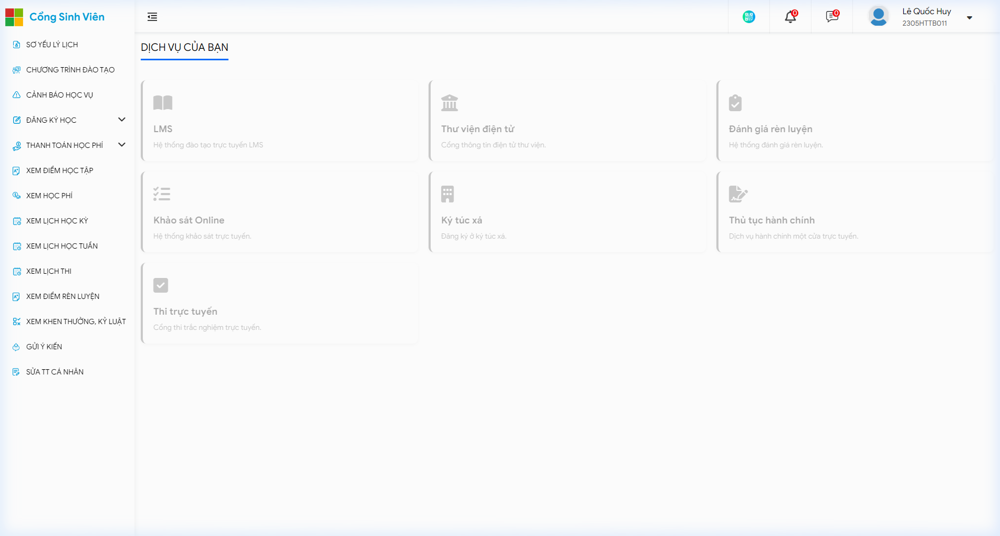
*Hình 2: Bố cục không gian làm việc trung tâm (Dashboard) và danh mục dịch vụ trực tuyến một cửa sau khi đăng nhập*

### **4. Hệ thống phân cấp các nhóm chức năng nghiệp vụ**

Toàn bộ các tính năng tác nghiệp của cổng sinh viên được phân rã khoa học thành tám phân hệ nghiệp vụ chính:

Phân hệ một là quản trị danh tính và an toàn truy cập, gồm các chức năng đăng nhập xác thực tập trung, đổi mật khẩu tài khoản định kỳ, khôi phục thông tin đăng nhập khi quên mật khẩu và đăng xuất an toàn.

Phân hệ hai là quản lý hồ sơ nhân thân sinh viên, gồm các chức năng tra cứu sơ yếu lý lịch trích ngang, cập nhật thông tin liên lạc cá nhân và xem các quyết định khen thưởng hoặc kỷ luật.

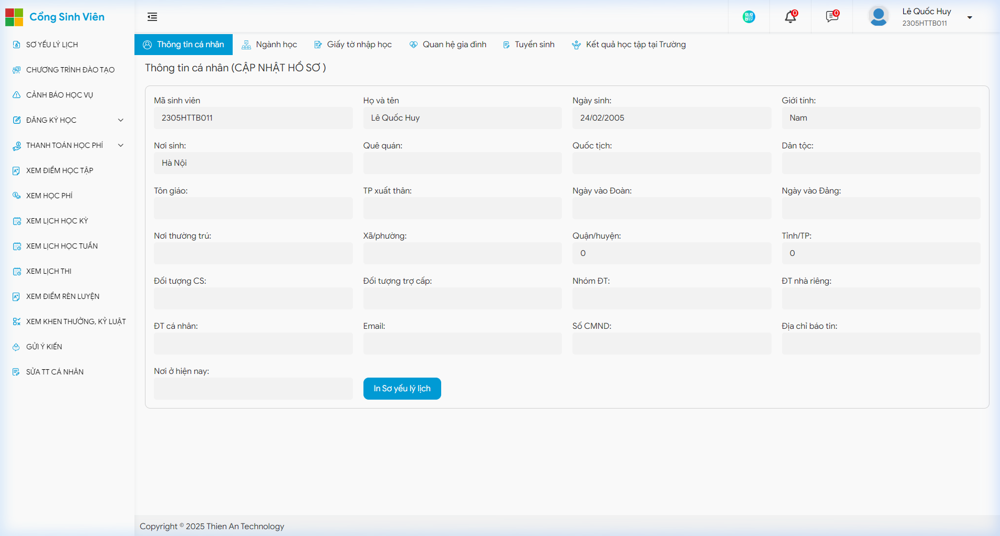
*Hình 3: Giao diện tra cứu sơ yếu lý lịch và hồ sơ nhân thân sinh viên trên hệ thống*

Phân hệ ba là kế hoạch và đăng ký học phần tín chỉ, gồm các chức năng tra cứu khung chương trình đào tạo, đăng ký học phần chính quy trong kỳ, đăng ký học lại hoặc học nâng điểm và in kết quả đăng ký môn học.

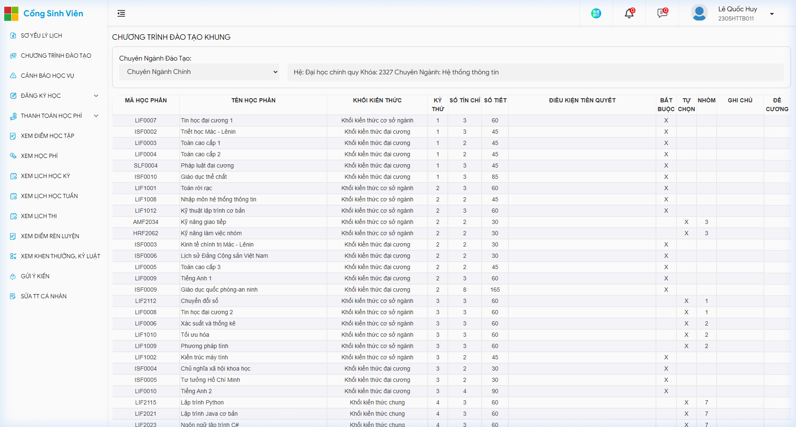
*Hình 4: Giao diện tra cứu chương trình đào tạo khung toàn khóa theo từng học kỳ đào tạo*

Phân hệ bốn là theo dõi thời khóa biểu và lịch thi, gồm các chức năng xem lịch học toàn học kỳ, xem thời khóa biểu chi tiết dạng ma trận theo từng tuần và tra cứu lịch thi kết thúc môn.

Phân hệ năm là đánh giá kết quả học tập và rèn luyện, gồm các chức năng xem bảng điểm tổng hợp toàn khóa, tra cứu bảng điểm chi tiết từng thành phần môn học, tự chấm điểm rèn luyện định kỳ và theo dõi trạng thái cảnh báo học vụ.

Phân hệ sáu là quản lý kinh phí đào tạo và học phí, gồm các chức năng tra cứu biểu học phí và công nợ, thực hiện thanh toán học phí trực tuyến liên kết ngân hàng và tra cứu xuất hóa đơn điện tử.

Phân hệ bảy là dịch vụ tương tác và hành chính một cửa, gồm các chức năng gửi ý kiến đóng góp, nộp phiếu khảo sát đánh giá giảng dạy và gửi đơn từ hành chính trực tuyến.

Phân hệ tám là liên kết dịch vụ vệ tinh, tích hợp chuyển tiếp người dùng tới các hệ thống đào tạo từ xa, thư viện số và thi trực tuyến.

## **III. Phân tích chi tiết các biểu mẫu nhập liệu**

### **1. Biểu mẫu đăng nhập hệ thống và xác thực tập trung**

Màn hình đăng nhập tại tệp Login.aspx được xây dựng theo phong cách giao diện chia đôi cân đối. Bên trái là hình ảnh đồ họa mang tính học thuật và thông điệp chuyển đổi số. Bên phải là khối biểu mẫu xác thực chính với biểu trưng Học viện và tiêu đề Hệ thống xác thực tập trung.

Các thành phần nhập liệu và tương tác trên biểu mẫu được phân tích chi tiết như sau:

Trường tài khoản sử dụng phần tử nhập văn bản một dòng mang mã điều khiển txtusername. Trường này có chức năng tiếp nhận mã sinh viên duy nhất, bắt buộc người dùng phải nhập dữ liệu và không được để khoảng trống.

Trường mật khẩu sử dụng phần tử nhập văn bản ẩn ký tự mang mã điều khiển txtpassword. Mọi ký tự gõ vào đều được hiển thị dưới dạng dấu chấm tròn bảo mật. Bên cạnh ô nhập có nút biểu tượng cho phép bật tắt chế độ hiển thị ký tự để người dùng kiểm tra độ chính xác khi nhập liệu.

Hộp kiểm duy trì đăng nhập mang mã điều khiển chkremember nhận giá trị đúng hoặc sai. Khi sinh viên tích chọn, hệ thống sẽ cấp phát tệp lưu trữ phiên làm việc dài hạn trên trình duyệt máy tính cá nhân, giúp hạn chế việc bị thoát phiên đột ngột.

Nút bấm đăng nhập mang mã điều khiển btnDangNhap có màu nền xanh nổi bật. Khi người dùng nhấn nút, sự kiện gửi dữ liệu được kích hoạt, truyền toàn bộ thông tin đăng nhập lên máy chủ qua phương thức mã hóa an toàn HTTPS để đối soát với cơ sở dữ liệu gốc.

Liên kết quên mật khẩu mang mã lnkQuenMatKhau hỗ trợ điều hướng người học đến trang hỗ trợ tự khôi phục quyền truy cập thông qua hòm thư điện tử sinh viên do Học viện cấp.

*Hình 5: Giao diện biểu mẫu đăng nhập hệ thống và xác thực tập trung tại địa chỉ Login.aspx*

### **2. Biểu mẫu đăng ký học phần tín chỉ chính quy và cải thiện điểm**

Biểu mẫu đăng ký tại tệp wfrmDangKyLopTinChiB1.aspx là giao diện có mức độ tương tác cao và phức tạp nhất trong toàn bộ hệ thống.

Cấu trúc giao diện biểu mẫu được tổ chức thành bốn khu vực mạch lạc:

Khu vực thứ nhất là bộ lọc lựa chọn nghiệp vụ, bao gồm ba danh sách thả xuống: danh sách chọn học kỳ tác nghiệp; danh sách chọn đợt đăng ký tương ứng với niên khóa sinh viên; và danh sách phân loại học phần cần đăng ký gồm học mới, học lại môn thi trượt hoặc học cải thiện nâng điểm.

Khu vực thứ hai là thanh chỉ số hạn ngạch tín chỉ. Khu vực này hiển thị các thông số định lượng giúp người học kiểm soát kế hoạch học tập, bao gồm: số tín chỉ tối thiểu bắt buộc phải tích lũy trong kỳ; số tín chỉ tối đa được phép đăng ký căn cứ vào học lực kỳ trước; số môn học đã lựa chọn; và tổng số tín chỉ thực tế đã được hệ thống ghi nhận.

Khu vực thứ ba là bảng danh sách các lớp học phần đang mở trong đợt đăng ký. Mỗi dòng học phần hiển thị đầy đủ các thông tin tác nghiệp gồm: mã học phần; tên học phần; tên lớp tín chỉ cụ thể; số tín chỉ của môn học; thứ học trong tuần; tiết học bắt đầu và kết thúc; phòng học tại giảng đường; họ tên giảng viên giảng dạy; sĩ số lớp tối đa; số lượng sinh viên đã đăng ký thành công; số lượng chỗ còn trống; và ô kiểm chọn đăng ký lớp.

Khu vực thứ tư là danh sách các lớp học phần sinh viên đã đăng ký thành công, thể hiện kết quả ghi nhận tạm thời trong cơ sở dữ liệu cùng mức học phí dự kiến tương ứng. Phía trên bảng kết quả bố trí ba nút lệnh thao tác chính: nút lưu đăng ký để xác nhận ghi dữ liệu; nút hủy lớp đã chọn để rút bớt môn học; và nút in kết quả đăng ký để xuất phiếu xác nhận lưu trữ.

Biểu mẫu được lập trình tích hợp bốn cơ chế kiểm soát tính hợp lệ tự động trong thời gian thực:

Một là cơ chế kiểm tra học phần tiên quyết: Hệ thống tự động truy vấn dữ liệu điểm số các kỳ học trước. Nếu môn học điều kiện chưa đạt điểm chuẩn tối thiểu từ 4.0 trên thang 10 trở lên, biểu mẫu sẽ khóa ô chọn của môn học sau và hiển thị thông báo lỗi bằng chữ màu đỏ yêu cầu sinh viên phải hoàn thành môn tiên quyết trước.

Hai là cơ chế kiểm tra xung đột thời khóa biểu: Khi sinh viên tích chọn một lớp học phần mới có thời gian thứ học và tiết học trùng lặp với bất kỳ lớp học phần nào đã được lưu trước đó, biểu mẫu lập tức chặn hành động và hiển thị thông báo lỗi chỉ rõ thời gian và tên lớp học phần bị trùng.

Ba là cơ chế kiểm soát sĩ số trần của lớp học: Số chỗ còn lại trong lớp được hệ thống tự động tính toán bằng hiệu số giữa sĩ số tối đa và số sinh viên đã đăng ký. Khi số chỗ còn lại giảm về 0, ô chọn lớp sẽ bị vô hiệu hóa hoàn toàn và hiển thị trạng thái lớp đã hết chỗ, ngăn chặn việc đăng ký vượt quá quy mô giảng đường.

Bốn là cơ chế kiểm soát hạn ngạch tín chỉ: Nếu việc đăng ký thêm một môn học làm cho tổng số tín chỉ vượt quá trần quy định tối đa là 25 tín chỉ, hệ thống sẽ từ chối lưu và yêu cầu sinh viên phải rút bớt môn hoặc làm thủ tục xin phê duyệt học vượt tại Phòng Quản lý Đào tạo.

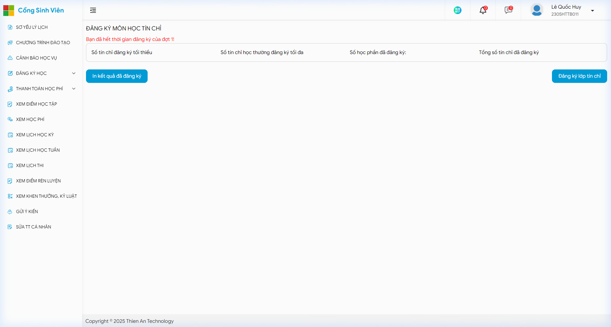
*Hình 6: Biểu mẫu đăng ký học phần tín chỉ chính quy và bộ lọc đợt đăng ký môn học*

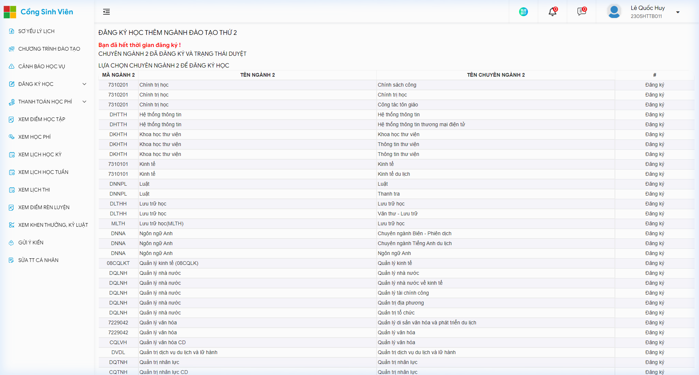
*Hình 7: Giao diện đăng ký học phần cho chương trình đào tạo ngành thứ hai (song bằng)*

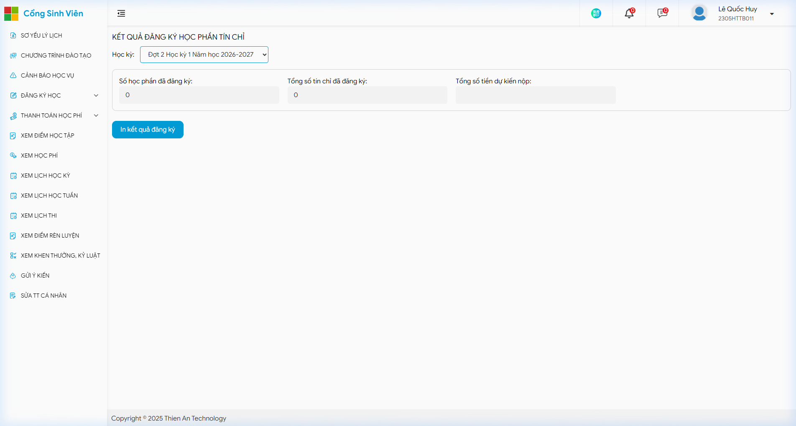
*Hình 8: Giao diện tóm lược kết quả đăng ký học phần tín chỉ và nút in phiếu xác nhận*

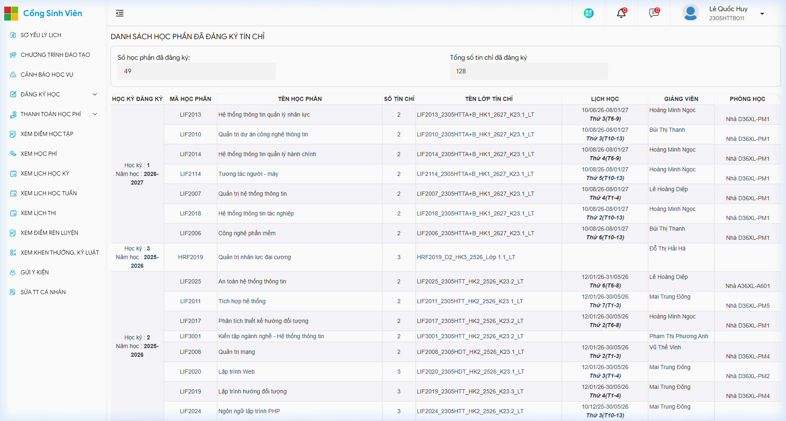
*Hình 9: Danh sách chi tiết các học phần tín chỉ sinh viên đã đăng ký thành công qua các học kỳ*

### **3. Biểu mẫu cập nhật thông tin cá nhân sinh viên**

Biểu mẫu tại tệp UpdateThongTinCaNhan.aspx được thiết kế tuân thủ nghiêm ngặt nguyên tắc bảo mật và toàn vẹn dữ liệu, phân chia rõ ràng thành hai khối thông tin:

Khối thông tin thứ nhất là hồ sơ pháp lý cố định ở trạng thái chỉ đọc, hoàn toàn bị khóa không cho phép sinh viên tự ý sửa đổi trên giao diện. Khối này bao gồm các trường: mã sinh viên; họ và tên; ngày tháng năm sinh; giới tính; số thẻ căn cước công dân; quê quán; lớp hành chính; khoa đào tạo; tình trạng đoàn đảng; và nơi đăng ký hộ khẩu thường trú. Mọi yêu cầu thay đổi các trường dữ liệu này đều bắt buộc sinh viên phải xuất trình trích lục tư pháp hoặc giấy tờ pháp lý gốc trực tiếp tại Phòng Quản lý Đào tạo.

Khối thông tin thứ hai là dữ liệu liên lạc linh hoạt cho phép sinh viên tự cập nhật khi có thay đổi trong quá trình học tập. Khối này bao gồm: địa chỉ thư điện tử cá nhân, được kiểm tra định dạng cấu trúc thư điện tử chuẩn; số điện thoại di động cá nhân và số điện thoại liên lạc của gia đình, được kiểm tra định dạng chuẩn 10 chữ số của các mạng viễn thông Việt Nam; địa chỉ nhận báo tin gia đình và nơi ở hiện tại tạm trú ngoại trú, bắt buộc nhập chi tiết từ 15 ký tự trở lên để phục vụ công tác quản lý của Phòng Công tác Sinh viên; và nút tải tệp tin ảnh chân dung nền xanh kích thước chuẩn, giới hạn định dạng tệp ảnh mở rộng và dung lượng không vượt quá 2 megabyte. Sau khi điền đủ dữ liệu, sinh viên nhấn nút lưu thay đổi để cập nhật dữ liệu vào hệ thống.

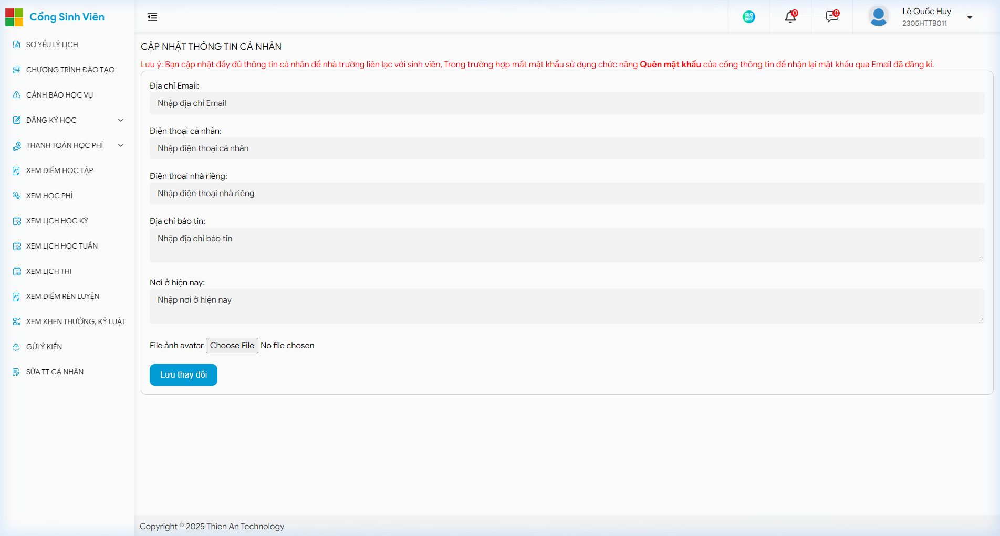
*Hình 10: Biểu mẫu cập nhật thông tin liên lạc và tải ảnh chân dung sinh viên tại UpdateThongTinCaNhan.aspx*

### **4. Biểu mẫu đổi mật khẩu tài khoản**

Giao diện đổi mật khẩu tại tệp DoiMatKhau.aspx cung cấp công cụ giúp người học chủ động bảo vệ an toàn thông tin cá nhân. Biểu mẫu bao gồm ba ô nhập liệu: ô nhập mật khẩu hiện tại để xác minh tính chính chủ trước khi thao tác; ô nhập mật khẩu mới cần thiết lập; và ô nhập lại mật khẩu mới để kiểm tra tính trùng khớp.

Hệ thống áp dụng chính sách kiểm tra độ mạnh của mật khẩu mới theo chuẩn an toàn thông tin: chuỗi mật khẩu phải có độ dài tối thiểu từ 8 ký tự trở lên; phải chứa đồng thời ít nhất một chữ cái viết hoa, một chữ cái viết thường, một chữ số và một ký tự đặc biệt. Bên cạnh đó, biểu mẫu sử dụng thành phần so sánh để đối chiếu dữ liệu giữa hai ô mật khẩu mới; nếu có bất kỳ sự sai lệch nào dù chỉ một ký tự, hệ thống sẽ hiển thị cảnh báo lỗi và không cho phép cập nhật.

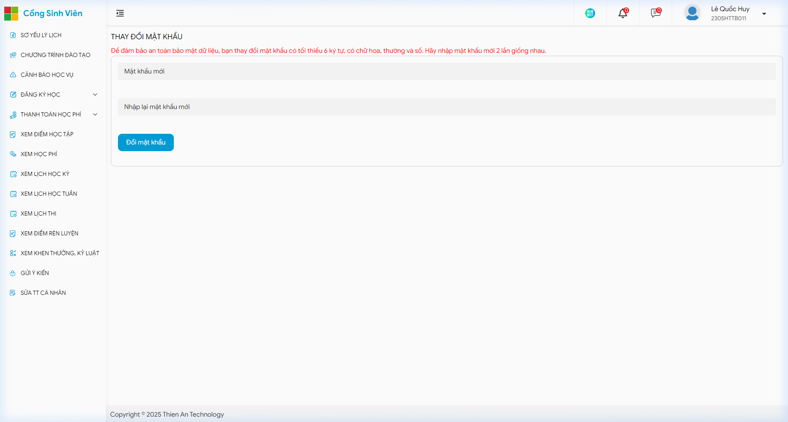
*Hình 11: Giao diện biểu mẫu thay đổi mật khẩu tài khoản cá nhân tại ChangePassword.aspx*

### **5. Biểu mẫu gửi ý kiến phản hồi và khảo sát chất lượng**

Biểu mẫu tại tệp GuiYKien.aspx thiết lập kênh thông tin hai chiều giữa sinh viên và Nhà trường. Các trường nhập liệu được tổ chức thuận tiện gồm: danh sách thả xuống chọn phòng ban chức năng tiếp nhận ý kiến; danh sách thả xuống chọn chủ đề phản ánh như học phí, cơ sở vật chất, lịch thi hoặc hoạt động giảng dạy; ô nhập tiêu đề ý kiến ngắn gọn; khung soạn thảo văn bản nhiều dòng dùng để diễn giải chi tiết nội dung phản ánh; nút đính kèm tài liệu minh chứng dạng văn bản hoặc hình ảnh; và nút gửi phản hồi để chuyển tiếp thông tin tới chuyên viên phụ trách.

### **6. Tổng hợp đặc tả kỹ thuật các biểu mẫu nhập liệu cốt lõi**

Hệ thống cổng thông tin vận hành dựa trên sáu biểu mẫu nhập liệu trọng tâm với các đặc tính kỹ thuật thống nhất:

Biểu mẫu đăng nhập xác thực tài khoản tại đường dẫn Login.aspx sử dụng phương thức truyền dữ liệu mã hóa HTTPS, kết hợp các thành phần hộp văn bản một dòng, hộp kiểm và nút gửi lệnh.

Biểu mẫu đăng ký học phần chính quy tại đường dẫn wfrmDangKyLopTinChiB1.aspx kết hợp tham số chuyên ngành và biểu mẫu đăng ký học lại tại cùng đường dẫn kết hợp tham số học lại đều vận hành dựa trên cơ chế nạp lại trang và kiểm soát trạng thái máy chủ, sử dụng các danh sách lựa chọn thả xuống, bảng lưới dữ liệu và các nút lưu điều khiển.

Biểu mẫu cập nhật thông tin cá nhân tại đường dẫn UpdateThongTinCaNhan.aspx sử dụng phương thức truyền dữ liệu đa thành phần kết hợp tải tệp tin, tích hợp các hộp văn bản cho phép sửa, các hộp văn bản khóa chỉ đọc và phần tử tải tệp ảnh.

Biểu mẫu đổi mật khẩu tài khoản tại đường dẫn DoiMatKhau.aspx áp dụng cơ chế kiểm tra hợp lệ dữ liệu ngay từ phía trình duyệt của người dùng trước khi gửi yêu cầu lên máy chủ.

Biểu mẫu gửi ý kiến và khảo sát môn học tại đường dẫn GuiYKien.aspx áp dụng phương thức truyền dữ liệu văn bản kết hợp tệp đính kèm, sử dụng danh sách thả xuống và vùng soạn thảo văn bản đa dòng.

Biểu mẫu thanh toán học phí và lệ phí trực tuyến tại đường dẫn ThanhToanHocPhi.aspx cung cấp phương thức tiếp nhận nghĩa vụ tài chính thông qua việc tích hợp cổng thanh toán trực tuyến, cho phép người học lựa chọn học kỳ tác nghiệp và liên kết xác thực giao dịch an toàn với hệ thống ngân hàng.

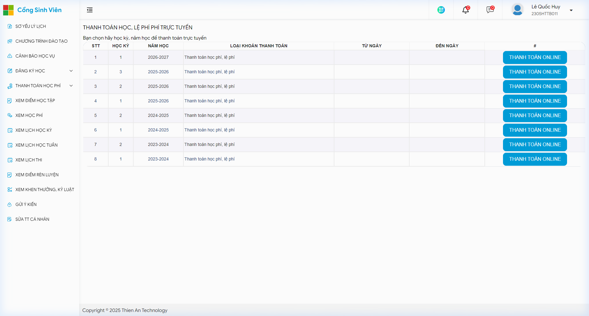
*Hình 12: Biểu mẫu lựa chọn học kỳ và thực hiện thanh toán học phí, lệ phí trực tuyến*

## **IV. Phân tích màn hình báo cáo, tra cứu và góc độ quản trị**

### **1. Màn hình báo cáo kết quả học tập và bảng điểm tích lũy**

Giao diện tại tệp KetQuaHocTap.aspx là nơi kết xuất trực quan toàn bộ tiến trình và kết quả rèn luyện học tập của sinh viên. Màn hình được bố trí khoa học gồm ba phần:

Phần thứ nhất là cụm chỉ số thống kê học vụ tổng hợp đặt ở đầu trang, thể hiện các đại lượng định lượng quan trọng: điểm trung bình chung tích lũy quy đổi về thang điểm 4 theo quy chế tín chỉ, đóng vai trò căn cứ xét cấp học bổng và xếp hạng bằng tốt nghiệp; xếp loại học lực tích lũy toàn khóa chia theo các mức Xuất sắc, Giỏi, Khá, Trung bình hoặc Yếu; tổng số tín chỉ đã tích lũy thành công đối chiếu với chuẩn đầu ra 135 tín chỉ của chương trình đào tạo; điểm trung bình chung học tập của riêng kỳ học đang chọn tính theo cả thang điểm 10 và thang điểm 4; và các chỉ báo cảnh báo số lượng môn thi lại, số lượng môn học lại và số lượng môn đang chờ công bố điểm.

Phần thứ hai là bảng điểm chi tiết theo từng học kỳ. Mỗi dòng bản ghi đại diện cho một môn học, thể hiện đầy đủ các thông tin: số thứ tự; học kỳ và năm học tương ứng; mã học phần; tên học phần; số lượng tín chỉ; điểm tổng kết theo thang điểm 10; điểm tổng kết quy đổi thang điểm 4; điểm chữ tương ứng từ A đến F; cột đánh dấu môn học không tính vào điểm trung bình chung; ghi chú kết quả đạt hoặc không đạt; và nút xem chi tiết.

Khi sinh viên nhấp vào nút xem chi tiết, hệ thống điều hướng đến trang KetQuaHocTapChiTiet.aspx để truy xuất cơ cấu điểm thành phần của môn học đó: điểm chuyên cần và thái độ học tập chiếm trọng số 10%; điểm kiểm tra thường xuyên và thảo luận nhóm chiếm trọng số 20%; điểm thi giữa kỳ chiếm trọng số 20%; và điểm thi kết thúc học phần chiếm trọng số 50%.

Phần thứ ba là bảng danh sách các học phần chưa tích lũy. Bảng này đối soát khung chương trình đào tạo chuẩn với kết quả thực tế của sinh viên, chỉ rõ các môn học thuộc khối kiến thức đại cương, cơ sở ngành hoặc chuyên ngành còn nợ để người học chủ động xây dựng lộ trình trả nợ môn trong các kỳ tiếp theo. Phía trên màn hình tích hợp nút lệnh in bảng điểm cho phép kết xuất dữ liệu ra mẫu in chuẩn để phục vụ nhu cầu lưu trữ cá nhân.

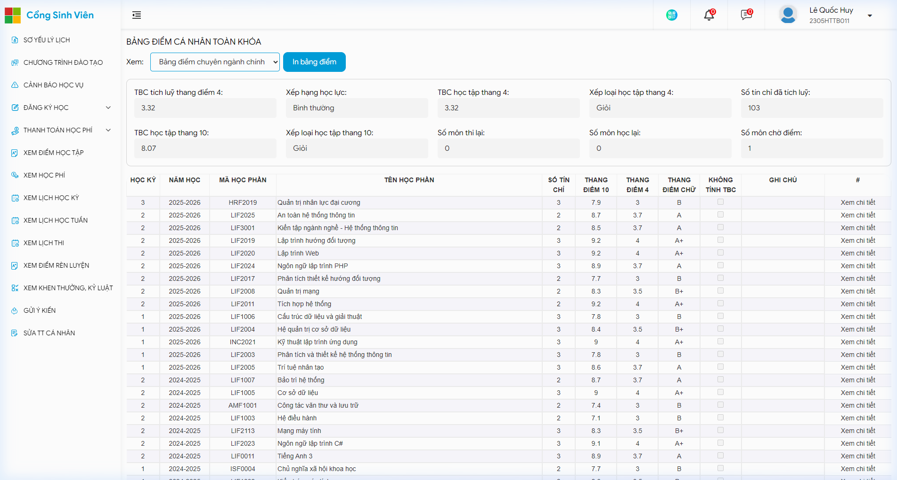
*Hình 13: Màn hình báo cáo bảng điểm cá nhân toàn khóa và chỉ số tích lũy tại KetQuaHocTap.aspx*

### **2. Màn hình báo cáo thông tin tài chính và học phí**

Giao diện tài chính tại tệp ThongTinTaiChinh.aspx minh bạch hóa toàn bộ các giao dịch kinh phí đào tạo giữa sinh viên và Nhà trường, được kết cấu thành ba mục rõ ràng:

Mục tổng quan tài chính ở đầu trang cung cấp các chỉ số cân đối tổng thể: tổng số tiền học phí phải nộp trong toàn khóa; tổng số tiền sinh viên đã thực nộp qua các kênh; tổng số tiền được hoàn trả hoặc miễn giảm; và tình trạng công nợ hiện thời, nếu số dư bằng 0 tức là sinh viên đã hoàn thành đầy đủ nghĩa vụ tài chính.

Mục một là bảng tổng hợp công nợ chi tiết theo từng khoản thu, thể hiện riêng biệt tiền học phí của từng học kỳ, năm học cùng các khoản thu bắt buộc khác như bảo hiểm y tế.

Mục hai là bảng chi tiết các khoản thu trong kỳ hiện hành, kê khai rõ mức thu học phí tương ứng với từng học phần mà sinh viên đã đăng ký thành công, số tiền được giảm trừ theo diện chính sách và số tiền còn lại phải thanh toán.

Mục ba là nhật ký các biên lai đã thu tiền và tính năng tra cứu hóa đơn điện tử. Bảng ghi nhận mã giao dịch, số hóa đơn điện tử, ngày nộp tiền, số tiền đã thanh toán và cung cấp liên kết tải hóa đơn điện tử hợp pháp có mã xác thực của cơ quan Thuế, tạo thuận lợi cho sinh viên khi cần thanh quyết toán kinh phí đào tạo với cơ quan hoặc phụ huynh.

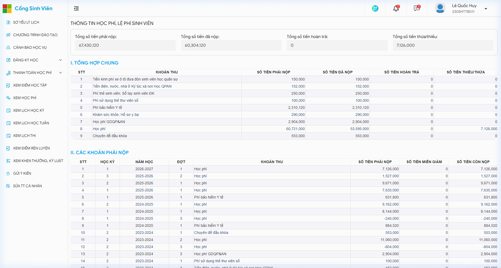
*Hình 14: Màn hình báo cáo thông tin tài chính, tổng hợp công nợ và các khoản thu chi học phí tại ThongTinTaiChinh.aspx*

### **3. Màn hình báo cáo thời khóa biểu và lịch thi**

Màn hình thời khóa biểu tuần tại tệp wfrmLichHocSinhVienTheoTuan.aspx được thiết kế theo dạng bảng ma trận hai chiều rất trực quan: trục ngang thể hiện các ngày trong tuần từ Thứ Hai đến Chủ Nhật; trục dọc chia theo ba buổi học gồm ca sáng từ tiết 1 đến tiết 6, ca chiều từ tiết 7 đến tiết 12 và ca tối từ tiết 13 đến tiết 15. Mỗi ô học phần trên ma trận hiển thị chi tiết tên môn học, mã lớp tín chỉ, phòng học cụ thể tại giảng đường, họ tên giảng viên phụ trách và hình thức học trực tiếp tại lớp hoặc học trực tuyến qua đường dẫn phòng học ảo.

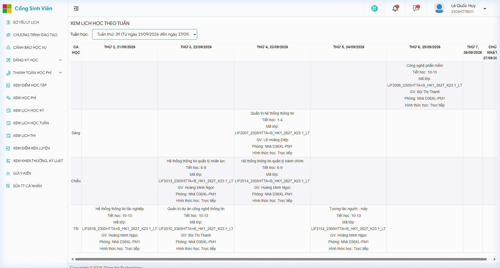
*Hình 15: Màn hình thời khóa biểu dạng ma trận hai chiều theo tuần học tại wfrmLichHocSinhVienTheoTuan.aspx*

Bên cạnh đó, hệ thống cung cấp màn hình lịch học kỳ tại tệp wfrmLichHocSinhVienTinChi.aspx để theo dõi danh mục môn học toàn khóa và màn hình lịch thi tại tệp wfrmLichThiSinhVien.aspx để tra cứu ngày thi, ca thi, giờ bắt đầu làm bài, số báo danh, phòng thi và hình thức thi trắc nghiệm trên máy tính, thi viết tự luận hoặc thi vấn đáp.

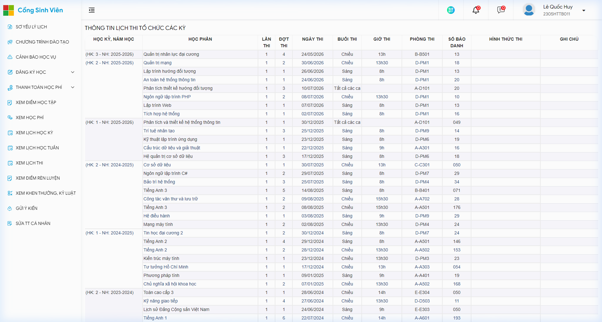
*Hình 16: Màn hình tra cứu thông tin lịch thi kết thúc học phần chi tiết theo ca và phòng thi tại wfrmLichThiSinhVien.aspx*

### **4. Màn hình báo cáo cảnh báo học vụ và tiến độ đào tạo**

Giao diện cảnh báo học vụ tại tệp CanhBaoHocVu.aspx giữ vai trò là hệ thống cảnh báo sớm giúp người học và cố vấn học tập chủ động phát hiện các nguy cơ gián đoạn học tập:

Hệ thống tự động đối chiếu số tín chỉ tích lũy thực tế của sinh viên với định mức chuẩn theo tiến độ của khóa học để đưa ra nhận định về tiến độ học tập là đúng hạn hay chậm trễ.

Cơ chế phân cấp cảnh báo học vụ được xây dựng dựa trên Quy chế đào tạo của Bộ Giáo dục và Đào tạo: Cảnh báo mức 1 áp dụng đối với sinh viên có điểm trung bình học kỳ dưới 1.0 ở kỳ đầu tiên hoặc dưới 1.2 ở các kỳ tiếp theo; Cảnh báo mức 2 áp dụng khi sinh viên bị cảnh báo mức 1 liên tiếp trong hai học kỳ hoặc nợ đọng vượt quá 24 tín chỉ chưa hoàn thành; và Cảnh báo mức 3 là ngưỡng nghiêm trọng nhất khi sinh viên bị cảnh báo mức 2 liên tiếp hoặc vượt quá thời gian đào tạo tối đa cho phép, hồ sơ sẽ được chuyển lên Hội đồng xét xử lý buộc thôi học.

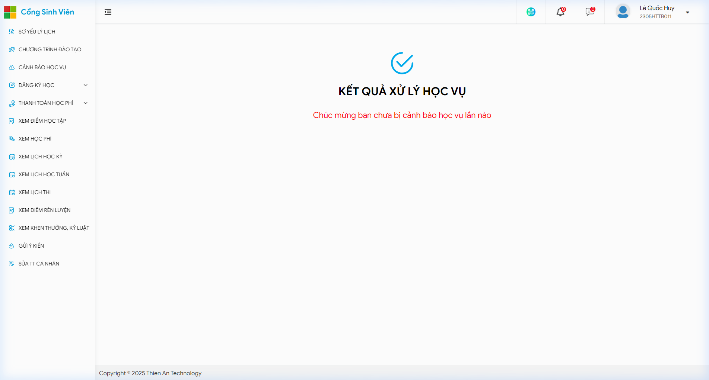
*Hình 17: Màn hình theo dõi trạng thái và kết quả xử lý cảnh báo học vụ của sinh viên tại KetQuaXulyHocvu.aspx*

### **5. Hệ thống báo cáo điều hành dưới góc độ quản trị hệ thống thông tin**

Mô hình vật lý ngoài không chỉ phục vụ nhu cầu của sinh viên mà còn cung cấp hệ thống giao diện báo cáo chuyên sâu phục vụ công tác điều hành của các đơn vị quản lý trong Học viện:

Đối với Phòng Quản lý Đào tạo: Hệ thống cung cấp báo cáo thống kê tình hình đăng ký tín chỉ và tải phòng học sau mỗi đợt đăng ký môn, giúp nhà quản lý nắm rõ tỷ lệ lấp đầy của từng lớp để ra quyết định hủy bỏ các lớp có dưới 15 sinh viên, mở thêm lớp phụ cho các môn quá tải và tối ưu hóa công suất sử dụng giảng đường. Ngoài ra, báo cáo tổng hợp cảnh báo học vụ và xét tốt nghiệp vào đầu mỗi học kỳ giúp đơn vị lập danh sách sinh viên vi phạm quy chế điểm số và danh sách đủ điều kiện công nhận tốt nghiệp cấp bằng.

Đối với Phòng Khảo thí và các Khoa chuyên môn: Hệ thống cung cấp báo cáo phân bố phổ điểm môn học sau mỗi kỳ thi, thể hiện tỷ lệ điểm chữ từ A đến F, điểm trung bình toàn khóa và độ lệch chuẩn. Báo cáo này giúp đánh giá độ khó và tính phân loại của đề thi, phát hiện những bất thường trong khâu chấm thi của giảng viên và làm căn cứ chuẩn hóa chất lượng giảng dạy.

Đối với Phòng Công tác Sinh viên: Hệ thống cung cấp báo cáo tổng hợp điểm rèn luyện toàn trường theo học kỳ, báo cáo bình xét học bổng khuyến khích học tập kết hợp giữa tiêu chí điểm học tập và điểm rèn luyện để phân bổ ngân sách học bổng công bằng, cùng báo cáo thống kê tiến độ giải quyết hồ sơ thủ tục hành chính một cửa và quản lý sinh viên ngoại trú.

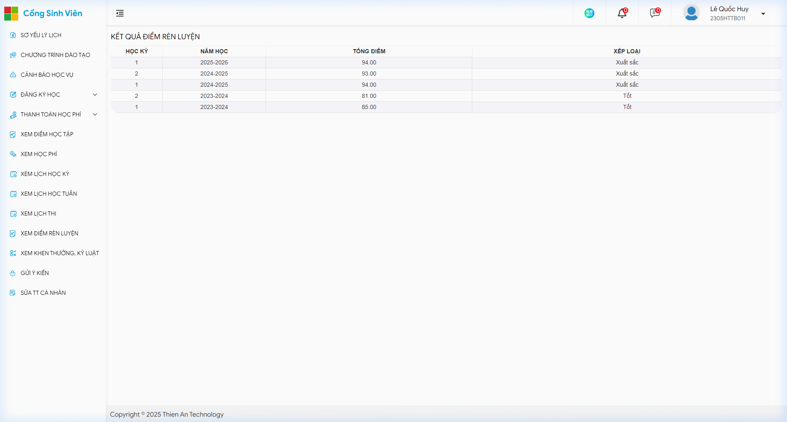
*Hình 18: Màn hình báo cáo tổng hợp kết quả đánh giá điểm rèn luyện sinh viên theo từng học kỳ*

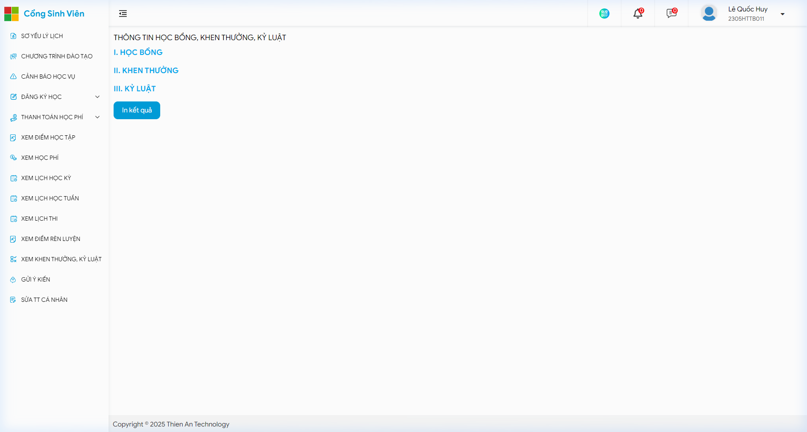
*Hình 19: Màn hình tra cứu thông tin xét cấp học bổng, quyết định khen thưởng và kỷ luật sinh viên*

Đối với Phòng Tài chính Kế toán: Hệ thống cung cấp báo cáo đối soát thu nợ học phí định kỳ hàng tháng, bóc tách chi tiết số tiền phải thu, số tiền đã thực thu và danh sách nợ đọng theo từng lớp. Dữ liệu này là căn cứ để kích hoạt cơ chế tự động khóa quyền đăng ký học phần và cấm thi đối với các trường hợp chưa hoàn thành nghĩa vụ tài chính.

Đối với Ban Quản trị hệ thống và Công nghệ thông tin: Hệ thống cung cấp màn hình giám sát hiệu năng máy chủ trong thời gian thực, đo lường mức tải vi xử lý, dung lượng bộ nhớ và số lượng phiên người dùng truy cập đồng thời vào các giờ cao điểm mở cổng đăng ký tín chỉ để chủ động điều phối tài nguyên, đồng thời cung cấp báo cáo nhật ký kiểm toán ghi nhận mọi thao tác nhập sửa điểm của giảng viên nhằm ngăn chặn gian lận điểm số.

Đối với Ban Giám đốc Học viện: Hệ thống cung cấp bảng điều khiển lãnh đạo tổng hợp tỷ lệ sinh viên tốt nghiệp đúng tiến độ, tỷ lệ chậm tiến độ và thôi học qua các năm, cùng báo cáo kết quả khảo sát mức độ hài lòng của người học đối với chất lượng đào tạo và dịch vụ của Học viện.

## **V. Phân tích các nhóm tác nhân người dùng và phương thức tương tác với giao diện hệ thống**

### **1. Nhận diện và phân loại toàn diện các nhóm tác nhân trong hệ thống**

Cơ chế vận hành của cổng thông tin đào tạo tín chỉ và hệ thống quản lý học vụ Học viện Hành chính và Quản trị công được thiết lập dựa trên sự tương tác đồng bộ của chín nhóm tác nhân với vai trò, trách nhiệm và phạm vi nghiệp vụ được phân định rõ ràng:

Tác nhân thứ nhất là sinh viên chính quy: Đây là nhóm người dùng cuối trung tâm và có số lượng đông đảo nhất của cổng thông tin. Mục tiêu tác nghiệp của sinh viên là theo dõi lộ trình đào tạo, đăng ký các lớp học phần trong từng học kỳ, tra cứu thời khóa biểu và lịch thi, theo dõi kết quả học tập và rèn luyện, hoàn thành nghĩa vụ tài chính học phí trực tuyến, cũng như gửi các yêu cầu dịch vụ hành chính một cửa đến Nhà trường.

Tác nhân thứ hai là giảng viên giảng dạy: Đây là chủ thể chuyên môn trực tiếp điều hành các lớp học phần. Giảng viên tương tác với hệ thống nhằm tiếp nhận lịch phân công giảng dạy, tải danh sách sinh viên phục vụ công tác điểm danh tại lớp, nhập các cột điểm đánh giá quá trình và điểm thi kết thúc học phần, đồng thời gửi thông báo học thuật đến sinh viên trong lớp phụ trách.

Tác nhân thứ ba là cố vấn học tập và trợ lý đào tạo khoa: Giữ vai trò giám sát, định hướng lộ trình học tập và hỗ trợ xử lý học vụ cấp cơ sở. Tác nhân này theo dõi sát sao kết quả học tập của từng sinh viên thuộc lớp sinh hoạt quản lý, phê duyệt đơn đăng ký học vượt hoặc học ghép, và trực tiếp can thiệp, tư vấn đối với các sinh viên bị rơi vào diện cảnh báo học vụ.

Tác nhân thứ tư là chuyên viên Phòng Quản lý Đào tạo: Là chủ thể quản trị quy trình học vụ trung tâm của toàn Học viện. Chuyên viên đào tạo chịu trách nhiệm thiết lập khung chương trình đào tạo, mở các đợt đăng ký tín chỉ trên hệ thống, phân bổ giảng đường, cấu hình chỉ tiêu sĩ số tối đa cho từng phòng học, thẩm định kết quả đăng ký môn học, khóa sổ điểm điện tử và xét duyệt điều kiện công nhận tốt nghiệp.

Tác nhân thứ năm là chuyên viên Phòng Tài chính - Kế toán: Chịu trách nhiệm quản lý dòng dữ liệu tài chính học vụ. Tác nhân này thiết lập bảng đơn giá tín chỉ theo năm học, nạp danh sách sinh viên được miễn giảm học phí diện chính sách, đối soát dòng tiền thanh toán trực tuyến qua kết nối ngân hàng, theo dõi công nợ học phí và phát hành hóa đơn điện tử hợp pháp cho người học.

Tác nhân thứ sáu là chuyên viên Phòng Công tác Sinh viên: Quản trị toàn diện hồ sơ nhân thân pháp lý và hoạt động rèn luyện của người học. Tác nhân này lưu trữ sơ yếu lý lịch gốc, tiếp nhận và thẩm định kết quả đánh giá điểm rèn luyện, xét duyệt học bổng khuyến khích học tập, theo dõi các chế tài khen thưởng kỷ luật và trực tiếp xử lý các hồ sơ dịch vụ hành chính một cửa gửi qua môi trường mạng.

Tác nhân thứ bảy là cán bộ Trung tâm Khảo thí và Đảm bảo chất lượng: Chịu trách nhiệm bảo đảm tính khách quan trong đánh giá và chuẩn hóa chất lượng đào tạo. Tác nhân này lập lịch thi học kỳ, phân chia ca thi và phòng thi, đánh số báo danh, phân công cán bộ coi thi, nhập điểm thi cuối kỳ, tiếp nhận và cập nhật điểm sau phúc khảo bài thi, đồng thời xây dựng và quản trị ngân hàng câu hỏi khảo sát chất lượng giảng dạy.

Tác nhân thứ tám là quản trị viên kỹ thuật hệ thống và an toàn thông tin: Đóng vai trò bảo đảm tính sẵn sàng và toàn vẹn của toàn bộ hạ tầng phần mềm và cơ sở dữ liệu. Quản trị viên thực hiện cấp phát và thu hồi tài khoản, cấu hình ma trận phân quyền vai trò, giám sát tải máy chủ trong các khung giờ cao điểm đăng ký tín chỉ, thực hiện sao lưu dự phòng định kỳ và giám sát nhật ký kiểm toán nhằm ngăn ngừa các cuộc tấn công mạng.

Tác nhân thứ chín là Ban Giám đốc Học viện và Lãnh đạo Khoa chuyên môn: Nhóm người dùng cấp chiến lược khai thác các báo cáo điều hành tổng hợp, bảng điều khiển thống kê tỷ lệ sinh viên tích lũy đúng hạn, tỷ lệ cảnh báo học vụ, biểu đồ phân bố điểm số và kết quả khảo sát mức độ hài lòng của người học để đưa ra các quyết định điều hành quản trị kịp thời.

### **2. Đặc tả chi tiết phương thức tương tác của các nhóm tác nhân trên từng trang, màn hình và biểu mẫu hệ thống**

Phương thức tương tác của các nhóm tác nhân với mô hình vật lý ngoài được thể hiện cụ thể thông qua hệ thống các màn hình giao diện đồ họa, các biểu mẫu nhập liệu và các công cụ điều khiển nghiệp vụ trên mười giao diện trọng yếu:

Màn hình thứ nhất là giao diện xác thực đăng nhập và bảo mật tài khoản: Trên màn hình đăng nhập, sinh viên và cán bộ giảng viên tương tác với hai ô văn bản nhập liệu bắt buộc gồm tên tài khoản định danh và mật khẩu truy cập. Giao diện tích hợp biểu tượng con mắt cho phép người dùng ẩn hoặc hiện mật khẩu để kiểm tra ký tự đã gõ. Người dùng nhấn nút lệnh Đăng nhập hoặc bấm phím Enter để gửi yêu cầu xác thực. Hệ thống kiểm tra hợp lệ tại máy khách nhằm ngăn chặn việc bỏ trống trường dữ liệu hoặc chèn các ký tự mã độc. Nếu người dùng nhập sai mật khẩu quá năm lần liên tiếp, giao diện lập tức khóa nút đăng nhập và hiển thị đồng hồ đếm ngược mười lăm phút nhằm phòng chống tấn công dò mật khẩu. Khi nhấp vào liên kết Quên mật khẩu, người dùng được dẫn đến biểu mẫu khai báo mã sinh viên và địa chỉ thư điện tử để nhận mã xác thực một lần. Đối với biểu mẫu đổi mật khẩu, người dùng nhập mật khẩu hiện tại, mật khẩu mới và xác nhận lại mật khẩu mới; hệ thống tích hợp thanh đo lường độ mạnh mật khẩu chuyển đổi màu sắc từ đỏ sang xanh lá để hướng dẫn người dùng thiết lập mật khẩu an toàn gồm chữ hoa, chữ thường, chữ số và ký tự đặc biệt.

Màn hình thứ hai là giao diện Bảng điều khiển trung tâm và Cổng dịch vụ hành chính một cửa: Sinh viên tương tác với bảng điều khiển chính thông qua cây thực đơn phân cấp ở lề trái màn hình để điều hướng giữa các phân hệ. Tại khu vực trung tâm, sinh viên xem các khối thẻ tóm tắt tiến độ học tập, biểu đồ điểm trung bình và lịch học trong ngày. Khi nhấp vào thẻ đồ họa Dịch vụ hành chính một cửa, sinh viên được chuyển đến biểu mẫu nộp hồ sơ trực tuyến. Tại đây, sinh viên chọn loại thủ tục cần giải quyết thông qua danh sách thả xuống gồm cấp giấy xác nhận sinh viên, cấp giấy vay vốn ngân hàng chính sách xã hội, cấp bảng điểm quá trình học tập hoặc giấy xác nhận tạm hoãn nghĩa vụ quân sự. Sinh viên nhập số lượng bản in cần cấp, chọn hình thức nhận kết quả qua thư điện tử hoặc nhận trực tiếp tại bàn tiếp nhận, gõ nội dung lý do vào ô văn bản đa dòng và nhấn nút lệnh Gửi yêu cầu. Hệ thống lập tức sinh mã hồ sơ theo dõi duy nhất và hiển thị huy hiệu trạng thái màu vàng biểu thị hồ sơ đang chờ tiếp nhận. Về phía chuyên viên Phòng Công tác Sinh viên, giao diện quản trị hiển thị danh sách các yêu cầu trực tuyến mới gửi về. Chuyên viên nhấp chuột vào từng hồ sơ để thẩm định điều kiện học vụ, bấm nút Tiếp nhận để chuyển trạng thái sang màu xanh dương biểu thị đang xử lý, tiến hành ký số văn bản điện tử hoặc in ấn đóng dấu bản cứng, sau đó cập nhật ngày hẹn trả kết quả và bấm nút Hoàn thành để hệ thống tự động gửi thông báo đến sinh viên.

Màn hình thứ ba là biểu mẫu đăng ký học phần tín chỉ trực tuyến: Đây là không gian tương tác có mật độ thao tác cao nhất trong năm học. Sinh viên tương tác với danh sách thả xuống để chọn đợt đăng ký và chọn khoa chuyên môn quản lý môn học. Hệ thống nạp danh sách các lớp học phần đang mở lên bảng dữ liệu dạng lưới, hiển thị chi tiết mã lớp, tên môn học, số tín chỉ, thời khóa biểu, phòng học, tên giảng viên và tỷ lệ sĩ số thời gian thực. Sinh viên nhấp chuột vào hộp kiểm lựa chọn trước lớp học phần mong muốn. Ngay khi hộp kiểm được kích hoạt, hệ thống tự động kiểm tra nhanh các xung đột về lịch học bằng tập lệnh phía trình duyệt. Khi sinh viên bấm nút Lưu đăng ký, hệ thống gửi yêu cầu về máy chủ kích hoạt cơ chế khóa dòng dữ liệu để bảo đảm lớp không vượt quá sĩ số trần phòng học. Nếu sĩ số đã đầy trong tích tắc xử lý, giao diện bật hộp thoại cảnh báo từ chối ghi nhận; nếu đăng ký thành công, thông tin lớp học phần lập tức được chuyển xuống bảng danh sách các lớp đã đăng ký thành công ở nửa dưới màn hình kèm tổng số tín chỉ tích lũy trong kỳ và số tiền học phí dự kiến. Trong khung thời hạn mở cổng, sinh viên có thể nhấp vào biểu tượng Hủy đăng ký để rút bớt môn học, hoặc nhấp nút lệnh In phiếu đăng ký học phần để xuất tệp đối chiếu có mã vạch xác thực. Về phía chuyên viên Phòng Quản lý Đào tạo, giao diện quản trị cho phép cấu hình mở hoặc đóng đợt đăng ký theo từng khối lớp, thiết lập giới hạn tín chỉ tối thiểu là mười bốn và tối đa là hai mươi tư tín chỉ, đồng thời theo dõi biểu đồ sĩ số thời gian thực để quyết định mở thêm lớp phụ hoặc hủy các lớp không đủ sĩ số mở lớp. Cố vấn học tập tương tác với biểu mẫu duyệt ngoại lệ để mở khóa cho phép sinh viên xuất sắc được đăng ký vượt trần tín chỉ.

Màn hình thứ tư là biểu mẫu cập nhật và chuẩn hóa hồ sơ thông tin cá nhân: Sinh viên truy cập biểu mẫu để kiểm tra toàn bộ thông tin lý lịch được phân tách thành bốn khối chuyên biệt gồm thông tin học vụ, thông tin cá nhân pháp lý, thông tin liên lạc và thông tin gia đình. Trên giao diện, các trường dữ liệu mang tính định danh pháp lý gốc như họ tên khai sinh, ngày tháng năm sinh, số căn cước công dân, giới tính và quê quán được hiển thị ở trạng thái khóa không cho phép sửa đổi với nền màu xám, kèm chỉ dẫn sinh viên phải nộp hồ sơ minh chứng gốc tại bộ phận một cửa nếu phát hiện sai lệch. Ngược lại, các trường dữ liệu liên lạc gồm số điện thoại di động cá nhân, địa chỉ thư điện tử dự phòng, nơi ở tạm trú hiện tại và thông tin người liên hệ khẩn cấp được thiết kế dưới dạng các ô nhập văn bản cho phép sinh viên trực tiếp chỉnh sửa. Sinh viên nhấp vào nút Chọn tệp ảnh thẻ để tải lên ảnh chân dung kích thước ba nhân bốn centimet chuẩn quy cách thẻ sinh viên; hệ thống kiểm tra định dạng tệp ảnh và hiển thị khung xem trước ảnh chụp. Khi sinh viên nhấn nút lệnh Lưu thông tin, hệ thống tự động kiểm tra định dạng số điện thoại và thư điện tử theo biểu thức quy chuẩn; nếu đáp ứng đầy đủ, dữ liệu mới sẽ được ghi đè vào cơ sở dữ liệu và hiển thị thông báo cập nhật hồ sơ thành công. Chuyên viên Phòng Công tác Sinh viên sử dụng giao diện quản trị để rà soát các thay đổi, đối chiếu với cơ sở dữ liệu quốc gia về dân cư và xác nhận phê duyệt dữ liệu.

Màn hình thứ năm là màn hình tra cứu kết quả học tập và giao diện quản lý nhập điểm học phần: Sinh viên tương tác với danh sách thả xuống chọn năm học và học kỳ cần tra cứu; giao diện kết xuất bảng điểm chi tiết dạng lưới dữ liệu thể hiện đầy đủ các cột điểm thành phần gồm điểm chuyên cần chiếm mười phần trăm, điểm kiểm tra thường xuyên chiếm hai mươi phần trăm, điểm bài tập lớn hoặc thảo luận chiếm hai mươi phần trăm, điểm thi kết thúc học phần chiếm năm mươi phần trăm, cùng điểm tổng kết thang mười, điểm chữ và điểm quy đổi thang bốn. Khối chân trang bảng điểm hiển thị tổng số tín chỉ tích lũy, điểm trung bình chung học kỳ, điểm trung bình chung tích lũy toàn khóa và xếp loại học lực tương ứng. Đối với các môn học vừa công bố điểm trong thời hạn bảy ngày, giao diện hiển thị thêm nút lệnh Gửi đơn phúc khảo cho phép sinh viên nhập lý do và gửi khiếu nại điểm thi trực tuyến đến Trung tâm Khảo thí. Về phía giảng viên giảng dạy, giao diện cổng giảng viên cung cấp biểu mẫu nhập điểm chuyên dụng; giảng viên chọn lớp học phần phụ trách, nhập điểm trực tiếp vào các ô bảng điểm hoặc bấm nút Tải tệp điểm mẫu định dạng bảng tính để nạp dữ liệu hàng loạt. Giao diện tự động kiểm tra tính hợp lệ của điểm số trong phạm vi từ không đến mười và chặn hoàn toàn các ký tự chữ cái. Giảng viên bấm nút Lưu tạm để tiếp tục hoàn thiện trong kỳ học, và bấm nút Gửi duyệt điểm khi kết thúc môn học. Cán bộ Trung tâm Khảo thí và chuyên viên Phòng Quản lý Đào tạo tiếp nhận bảng điểm, đối chiếu bài thi gốc, nhập điểm thi kết thúc học phần và nhấn nút Khóa sổ điểm điện tử để công bố kết quả học tập chính thức lên cổng sinh viên, chấm dứt hoàn toàn quyền chỉnh sửa dữ liệu của giảng viên.

Màn hình thứ sáu là màn hình tra cứu tài chính và Cổng nộp học phí trực tuyến: Sinh viên truy cập phân hệ tài chính để theo dõi bảng kê chi tiết toàn bộ các khoản phải nộp trong học kỳ, bao gồm học phí của từng học phần đã đăng ký thành công, các khoản phụ thu bảo hiểm y tế bắt buộc, số tiền được miễn giảm theo diện chính sách và số dư lũy kế từ kỳ trước chuyển sang. Màn hình hiển thị nổi bật tổng số tiền còn nợ và thời hạn cuối cùng phải hoàn thành nghĩa vụ tài chính. Để nộp tiền, sinh viên nhấp vào nút lệnh Thanh toán học phí trực tuyến; hệ thống kích hoạt cửa sổ giao diện thanh toán thông minh hiển thị mã phản hồi nhanh động có nhúng sẵn mã sinh viên, mã hóa đơn học kỳ và số tiền chính xác đến từng đồng. Sinh viên mở ứng dụng ngân hàng di động quét mã phản hồi nhanh để hoàn tất chuyển khoản trong tích tắc. Ngay khi tài khoản ngân hàng của Học viện ghi nhận biến động số dư, giao diện trình duyệt của sinh viên tự động cập nhật trạng thái thanh toán từ màu đỏ sang màu xanh lá biểu thị đã nộp đủ tiền, đồng thời xuất hiện nút lệnh Tải hóa đơn điện tử định dạng tài liệu số có chữ ký điện tử hợp pháp của Học viện. Về phía chuyên viên Phòng Tài chính - Kế toán, màn hình quản trị cung cấp bảng điều khiển dòng tiền thực thu trong ngày, công cụ đối soát tự động sao kê ngân hàng và chức năng xuất danh sách sinh viên nợ học phí quá hạn để phối hợp với Phòng Quản lý Đào tạo áp dụng các chế tài xử lý như tạm khóa quyền đăng ký học phần kỳ mới hoặc không cấp số báo danh dự thi.

Màn hình thứ bảy là màn hình thời khóa biểu và Lịch thi học kỳ: Sinh viên tương tác với danh sách thả xuống chọn học kỳ và thanh nút bấm chọn tuần học trong năm để xem lịch học tương ứng. Giao diện hỗ trợ chuyển đổi linh hoạt giữa hai chế độ hiển thị: chế độ xem dạng lưới ma trận tuần bảy ngày nhân mười hai tiết học, hoặc chế độ xem dạng danh sách tuần tự theo thời gian. Trong ma trận lịch học, mỗi lớp học phần được thể hiện bằng một khối thẻ trực quan ghi rõ tên môn học, mã lớp tín chỉ, tiết bắt đầu và tiết kết thúc, ký hiệu giảng đường cùng họ tên giảng viên giảng dạy. Sinh viên nhấp chuột vào khối thẻ lớp học để mở cửa sổ nhỏ hiển thị thông tin liên lạc của giảng viên và đề cương môn học. Trên màn hình lịch thi, hệ thống hiển thị danh sách các môn thi xếp theo trình tự thời gian tổ chức thi gồm ngày thi, ca thi, giờ phát đề, phòng thi, số báo danh và hình thức thi như tự luận, trắc nghiệm, vấn đáp hoặc nộp tiểu luận. Sinh viên nhấp vào nút lệnh In lịch thi để tải về thẻ dự thi có mã nhận diện cá nhân phục vụ công tác kiểm tra tại cửa phòng thi. Giảng viên giảng dạy sử dụng giao diện này để tra cứu lịch giảng dạy cá nhân và lịch coi thi; trong khi chuyên viên Phòng Quản lý Đào tạo sử dụng màn hình điều phối phòng học để cập nhật thông tin dời phòng hoặc đổi lịch học khi có sự cố phát sinh, kích hoạt thông báo tức thời đến màn hình của người học.

Màn hình thứ tám là màn hình giám sát cảnh báo học vụ và xử lý học vị: Đối với sinh viên có kết quả học tập yếu kém chạm ngưỡng vi phạm quy chế đào tạo, ngay khi đăng nhập hệ thống sẽ bật biểu ngữ cảnh báo nổi bật màu đỏ ở đầu trang và tự động chuyển hướng đến màn hình xử lý học vụ. Trên giao diện này, sinh viên được thông báo cụ thể mức độ cảnh báo học vụ gồm mức một nhắc nhở, mức hai buộc giảm tải tín chỉ hoặc mức ba nguy cơ buộc thôi học, kèm bảng chi tiết các chỉ số vi phạm như điểm trung bình học kỳ dưới ngưỡng tối thiểu hoặc nợ quá số tín chỉ cho phép. Giao diện cung cấp nút lệnh Tải biểu mẫu cam kết khắc phục học vụ và công cụ đặt lịch hẹn làm việc trực tuyến với cố vấn học tập. Về phía cố vấn học tập, màn hình quản lý lớp sinh hoạt hiển thị danh sách sinh viên được phân nhóm theo màu sắc trạng thái cảnh báo; cố vấn nhấp chuột vào hồ sơ từng sinh viên để tra cứu toàn bộ lịch sử điểm số, nhập biên bản làm việc tư vấn học vụ trực tiếp trên hệ thống và phê duyệt kế hoạch cải thiện điểm số của sinh viên. Hội đồng xử lý học vụ và Ban Giám đốc Học viện khai thác màn hình này để xem xét báo cáo tổng hợp sinh viên vi phạm quy chế đào tạo trên toàn trường và thực hiện thao tác ký duyệt quyết định xử lý học vụ điện tử.

Màn hình thứ chín là biểu mẫu đánh giá điểm rèn luyện và dịch vụ thi đua sinh viên: Sinh viên tương tác với danh sách thả xuống chọn học kỳ đánh giá rèn luyện; hệ thống hiển thị bảng tiêu chí tự đánh giá gồm năm nội dung chuẩn theo quy định của Bộ Giáo dục và Đào tạo. Sinh viên nhấp chuột vào các ô văn bản để tự chấm điểm cho từng tiêu chí thành phần; đối với các tiêu chí cộng điểm thành tích tham gia phong trào thi đua, nghiên cứu khoa học hoặc hoạt động tình nguyện, sinh viên bắt buộc nhấp nút lệnh Tải tệp minh chứng để đính kèm tệp ảnh giấy khen hoặc giấy chứng nhận hợp lệ. Giao diện tự động tính tổng điểm và xếp loại rèn luyện tạm tính; sinh viên nhấn nút Gửi đánh giá để khóa biểu mẫu tự chấm và chuyển hồ sơ lên cấp ban cán sự lớp. Ban cán sự lớp và cố vấn học tập đăng nhập giao diện đánh giá cấp chi đoàn để kiểm tra các tệp minh chứng đính kèm, thực hiện điều chỉnh điểm số nếu sinh viên chấm chưa chính xác và bấm nút Duyệt điểm cấp lớp. Chuyên viên Phòng Công tác Sinh viên sử dụng giao diện thẩm định toàn trường để phê duyệt kết quả cuối cùng, xuất bảng điểm rèn luyện chính thức phục vụ công tác xét cấp học bổng khuyến khích học tập và bình xét thi đua khen thưởng cuối năm học.

Màn hình thứ mười là biểu mẫu khảo sát chất lượng giảng dạy và lấy ý kiến phản hồi: Vào giai đoạn cuối mỗi học kỳ, hệ thống kích hoạt cơ chế nghiệp vụ cưỡng chế; sinh viên khi truy cập cổng thông tin sẽ được điều hướng bắt buộc vào biểu mẫu khảo sát ý kiến người học trước khi được phép xem điểm thi hoặc đăng ký tín chỉ kỳ mới. Trên màn hình khảo sát, sinh viên thấy danh sách toàn bộ các lớp học phần đã học trong kỳ kèm huy hiệu trạng thái chưa hoàn thành màu đỏ hoặc đã hoàn thành màu xanh lá. Khi chọn từng môn học, giao diện hiển thị bảng câu hỏi khảo sát chia thành bốn nhóm tiêu chuẩn gồm nội dung chương trình, phương pháp giảng dạy của giảng viên, tinh thần trách nhiệm và phương pháp kiểm tra đánh giá. Sinh viên nhấp chọn các nút chọn tròn theo thang đo năm mức độ hài lòng, đồng thời có thể nhập góp ý tự do vào ô văn bản đa dòng ở cuối biểu mẫu. Khi sinh viên bấm nút Gửi phiếu khảo sát, hệ thống kiểm tra bảo đảm toàn bộ câu hỏi bắt buộc đã được trả lời, tự động mã hóa ẩn danh tính của người khảo sát để bảo đảm tính khách quan tuyệt đối, và chuyển trạng thái môn học sang đã hoàn thành. Khi hoàn thành khảo sát toàn bộ các môn học, hệ thống lập tức dỡ bỏ cơ chế cưỡng chế và mở khóa toàn bộ quyền tra cứu của người học. Cán bộ Trung tâm Khảo thí và Đảm bảo chất lượng sử dụng giao diện quản trị để theo dõi tiến độ khảo sát thời gian thực, trích xuất báo cáo phân tích định lượng điểm trung bình của từng giảng viên và báo cáo định tính tổng hợp phản ánh của người học gửi Ban Giám đốc phục vụ công tác quản trị chất lượng.

### **3. Ma trận phân quyền kiểm soát truy cập nghiệp vụ diễn giải bằng văn xuôi**

Cơ chế kiểm soát truy cập dựa trên vai trò của hệ thống quy định minh bạch quyền hạn tạo mới, tra cứu, cập nhật và xóa bỏ dữ liệu của chín nhóm tác nhân trên tám phân hệ nghiệp vụ cốt lõi:

Phân hệ thứ nhất là hồ sơ nhân thân pháp lý và lý lịch sinh viên: Sinh viên, giảng viên và cố vấn học tập chỉ có quyền tra cứu thông tin; Phòng Quản lý Đào tạo, Phòng Công tác Sinh viên và Quản trị viên hệ thống nắm giữ toàn quyền tạo mới, tra cứu, cập nhật và xóa bỏ bản ghi khi có văn bản pháp lý hợp lệ; Phòng Tài chính - Kế toán có quyền tra cứu để phục vụ công tác đối soát đối tượng chính sách miễn giảm.

Phân hệ thứ hai là thông tin liên lạc và hồ sơ số hóa sinh viên: Sinh viên có quyền tra cứu và trực tiếp cập nhật số điện thoại, thư điện tử dự phòng, địa chỉ tạm trú và tải ảnh thẻ cá nhân của chính mình; Phòng Công tác Sinh viên nắm quyền tra cứu và cập nhật để phục vụ công tác quản lý người học; các đơn vị đào tạo, khảo thí và kế toán có quyền tra cứu thông tin liên lạc khi cần thông báo nghiệp vụ khẩn cấp.

Phân hệ thứ ba là kế hoạch đào tạo, danh mục học phần và thời khóa biểu mở lớp: Phòng Quản lý Đào tạo nắm giữ toàn quyền tạo mới, tra cứu, cập nhật và xóa bỏ danh mục môn học, kế hoạch giảng dạy và phân bổ giảng đường; giảng viên và sinh viên có quyền tra cứu lịch biểu; Phòng Tài chính - Kế toán có quyền tra cứu danh mục môn học để xây dựng biểu giá thu học phí.

Phân hệ thứ tư là dữ liệu đăng ký môn học và phân bổ lớp tín chỉ: Trong khung thời gian Nhà trường mở cổng quy định, sinh viên có quyền tạo mới, tra cứu và xóa bỏ các lớp môn học trong giỏ đăng ký của bản thân; cố vấn học tập có quyền tra cứu và cập nhật phê duyệt đối với các trường hợp sinh viên đăng ký học vượt hoặc học ghép; Phòng Quản lý Đào tạo nắm toàn quyền quản trị cấu hình mở lớp, điều chuyển sinh viên và khóa dữ liệu đăng ký; Phòng Tài chính - Kế toán tra cứu danh sách đăng ký thành công để tính toán công nợ học phí.

Phân hệ thứ năm là bảng điểm thành phần, điểm thi kết thúc học phần và điểm rèn luyện: Sinh viên chỉ có quyền tra cứu kết quả điểm số và rèn luyện cá nhân; giảng viên giảng dạy có quyền tạo mới, tra cứu và cập nhật điểm quá trình trước thời điểm gửi duyệt; Trung tâm Khảo thí và Đảm bảo chất lượng nắm quyền tạo mới điểm thi, cập nhật điểm phúc khảo và khóa sổ điểm điện tử; Phòng Quản lý Đào tạo nắm quyền phê duyệt kết quả cuối cùng và thẩm định xét tốt nghiệp; Phòng Công tác Sinh viên có quyền tra cứu điểm để làm căn cứ bình xét học bổng khuyến khích học tập.

Phân hệ thứ sáu là dữ liệu học phí, miễn giảm chính sách và chứng từ thanh toán điện tử: Sinh viên chỉ có quyền tra cứu số tiền phải nộp, trạng thái thanh toán và tải biên lai thu tiền cá nhân; Phòng Tài chính - Kế toán giữ toàn quyền thiết lập biểu giá tín chỉ, xác nhận thanh toán, cập nhật trạng thái công nợ và phát hành hóa đơn điện tử; Phòng Quản lý Đào tạo và Phòng Công tác Sinh viên có quyền tra cứu danh sách hoàn thành học phí để phục vụ xét tư cách dự thi và xét khen thưởng.

Phân hệ thứ bảy là dịch vụ hành chính một cửa và phản hồi khảo sát chất lượng: Sinh viên có quyền tạo mới đơn yêu cầu hành chính, tra cứu tiến độ xử lý và gửi phiếu khảo sát chất lượng ẩn danh; Phòng Công tác Sinh viên và các phòng ban chức năng có quyền tra cứu, cập nhật trạng thái xử lý hồ sơ và trả kết quả cho sinh viên; Trung tâm Khảo thí và Đảm bảo chất lượng nắm quyền tạo mới ngân hàng câu hỏi khảo sát và trích xuất báo cáo kết quả đánh giá chất lượng giảng dạy.

Phân hệ thứ tám là quản trị cấu hình hệ thống, phân quyền vai trò và nhật ký kiểm toán: Quyền hạn tạo mới, tra cứu, cập nhật và xóa bỏ trên phân hệ này thuộc quyền hạn độc quyền của Quản trị viên kỹ thuật hệ thống nhằm bảo vệ toàn vẹn kiến trúc vận hành và tính bảo mật của toàn bộ cơ sở dữ liệu; Ban Giám đốc Học viện có quyền tra cứu báo cáo nhật ký kiểm toán cấp cao khi tiến hành thanh tra nội bộ.

### **4. Cơ chế kiểm soát phiên làm việc và bảo vệ dữ liệu cá nhân theo Nghị định số 13/2023/NĐ-CP**

Nhằm bảo đảm an toàn thông tin, ngăn ngừa các hành vi truy cập trái phép và bảo vệ quyền riêng tư của người học trên không gian mạng, hệ thống áp dụng bốn cơ chế bảo mật tiêu chuẩn:

Thứ nhất là cơ chế quản lý vòng đời phiên làm việc và tự động hủy phiên: Khi người dùng xác thực thành công qua màn hình đăng nhập, máy chủ cấp phát một mã nhận diện phiên làm việc duy nhất ngẫu nhiên được mã hóa bằng thuật toán an toàn để duy trì trạng thái đăng nhập. Nhằm ngăn ngừa rủi ro bị kẻ xấu đánh cắp tài khoản khi sinh viên sử dụng máy tính công cộng tại phòng máy hoặc thư viện mà quên đăng xuất, hệ thống cài đặt cơ chế tự động hủy phiên làm việc sau đúng hai mươi phút không có bất kỳ thao tác gửi nhận dữ liệu nào từ trình duyệt. Khi phiên làm việc hết hạn, mọi yêu cầu tiếp theo đều bị chặn lại và hệ thống tự động dẫn hướng người dùng về màn hình đăng nhập.

Thứ hai là cơ chế phòng chống tấn công mạo danh và giả mạo yêu cầu từ máy khách: Hệ thống tích hợp các chuỗi mã thông báo bảo mật động vào từng biểu mẫu nhập liệu và kiểm tra tính toàn vẹn của trạng thái giao diện máy chủ trước khi xử lý dữ liệu gửi lên. Cơ chế này ngăn chặn hiệu quả các hình thức tấn công giả mạo yêu cầu từ trang web khác và tấn công tái gửi gói tin nhằm can thiệp trái phép vào kết quả đăng ký môn học hoặc thay đổi thông tin liên lạc.

Thứ ba là nguyên tắc phân quyền tối thiểu và cô lập tuyệt đối dữ liệu người dùng: Mỗi tài khoản sinh viên được hệ thống gắn chặt với biến định danh mã sinh viên lấy trực tiếp từ phiên đăng nhập an toàn ở phía máy chủ. Mọi truy vấn cơ sở dữ liệu trên các phân hệ điểm số, học phí hay lịch thi đều tự động chèn thêm điều kiện ràng buộc mã định danh người dùng. Sinh viên hoàn toàn không thể xem hoặc can thiệp vào dữ liệu học tập của sinh viên khác bằng cách cố tình thay đổi tham số định danh trên thanh địa chỉ của trình duyệt web.

Thứ tư là tuân thủ nghiêm ngặt các quy định về bảo vệ dữ liệu cá nhân theo Nghị định số 13/2023/NĐ-CP của Chính phủ: Toàn bộ các thông tin định danh cá nhân nhạy cảm của người học gồm số thẻ căn cước công dân, ngày tháng năm sinh, địa chỉ nơi cư trú và số điện thoại liên lạc đều được mã hóa trên đường truyền mạng thông qua giao thức bảo mật lớp truyền tải và bảo vệ nghiêm ngặt trong cơ sở dữ liệu. Hệ thống tuyệt đối không hiển thị các trường dữ liệu nhạy cảm này trên các danh sách lớp học phần hoặc thời khóa biểu công cộng. Đồng thời, toàn bộ các hành vi truy cập, tra cứu và chỉnh sửa dữ liệu người dùng của cán bộ quản lý đều được ghi vết tự động vào nhật ký kiểm toán lưu trữ địa chỉ mạng, thời gian thao tác và nội dung thay đổi để phục vụ công tác thanh tra, giám sát an toàn thông tin theo quy định của pháp luật.

## **VI. Đánh giá giao diện, trải nghiệm người dùng và đề xuất hoàn thiện**

### **1. Ưu điểm của mô hình vật lý ngoài hiện tại**

Qua quá trình khảo sát thực tế, mô hình vật lý ngoài của cổng thông tin sinh viên Học viện Hành chính và Quản trị công thể hiện ba ưu điểm nổi bật:

Một là bao quát toàn diện chu trình học tập của sinh viên: Hệ thống tích hợp đầy đủ các mắt xích nghiệp vụ từ khâu nhập học, khai báo sơ yếu lý lịch, đăng ký môn học, tra cứu lịch biểu, theo dõi điểm số, thanh toán học phí cho đến nộp đơn từ một cửa và xét tốt nghiệp.

Hai là khả năng trực quan hóa thông tin học vụ tương đối tốt: Bảng điểm được kết xuất rõ ràng, thể hiện đồng thời nhiều thang đo điểm số và chỉ rõ danh sách các môn học còn nợ đọng, giúp người học dễ dàng nắm bắt kết quả học tập và định hướng lộ trình trả nợ môn.

Ba là khả năng tiếp cận dịch vụ trực tuyến thuận tiện: Việc bố trí bảy thẻ dịch vụ đào tạo từ xa, thư viện số, ký túc xá và thủ tục hành chính ngay tại trang chủ giúp sinh viên tiết kiệm thời gian di chuyển giữa các nền tảng điện tử của Học viện.

### **2. Hạn chế, điểm nghẽn trải nghiệm và rủi ro vận hành**

Bên cạnh những kết quả đạt được, hệ thống vẫn tồn tại một số điểm nghẽn kỹ thuật và trải nghiệm người dùng cần sớm được khắc phục:

Hạn chế lớn nhất là kiến trúc nạp lại trang toàn phần truyền thống của nền tảng web cũ. Mỗi thao tác lọc học kỳ, chọn môn học hoặc lưu kết quả đều kích hoạt việc nạp lại toàn bộ trang web kèm khối dữ liệu trạng thái máy chủ dung lượng lớn. Vào các khung giờ cao điểm mở cổng đăng ký tín chỉ khi có hàng nghìn sinh viên truy cập đồng thời, cơ chế này gây nghẽn băng thông, làm quá tải máy chủ xử lý và dẫn đến hiện tượng treo trang web.

Hạn chế thứ hai là khả năng tương thích hiển thị trên thiết bị di động chưa được tối ưu hóa. Các bảng dữ liệu phức tạp như thời khóa biểu tuần và bảng điểm chi tiết được thiết kế theo kích thước cố định của màn hình máy tính để bàn. Khi sinh viên truy cập bằng điện thoại di động thông minh, bảng dữ liệu bị tràn ngang khiến người dùng phải liên tục cuộn ngang màn hình, gây khó khăn và dễ nhầm lẫn thông tin môn học.

Hạn chế thứ ba là thiếu các phản hồi tương tác vi mô tức thời. Khi sinh viên nhấn nút lưu đăng ký môn học, giao diện chưa có thanh tiến trình biểu thị hệ thống đang ghi nhận dữ liệu, tạo tâm lý sốt ruột khiến sinh viên bấm nút liên tục nhiều lần, làm gia tăng tải không cần thiết lên máy chủ.

Hạn chế thứ tư là biểu mẫu cập nhật thông tin liên lạc chưa tích hợp cơ chế xác thực hai lớp. Việc chỉnh sửa số điện thoại và thư điện tử nhận tin chưa yêu cầu mã xác thực gửi về số điện thoại cũ, tiềm ẩn nguy cơ mất quyền kiểm soát kênh nhận thông báo nếu sinh viên vô ý để lộ mật khẩu đăng nhập.

Hạn chế thứ năm là hệ thống chưa cung cấp công cụ mô phỏng dự báo điểm số giúp người học tự tính toán trước mức điểm các môn trong kỳ cần đạt để nâng hạng học lực hoặc tránh bị xử lý cảnh báo học vụ.

### **3. Đề xuất hoàn thiện mô hình vật lý ngoài hướng tới đại học thông minh**

Để đáp ứng chiến lược chuyển đổi số toàn diện của Học viện Hành chính và Quản trị công, mô hình vật lý ngoài của cổng sinh viên cần được nâng cấp theo lộ trình ba giai đoạn:

Giai đoạn một là tối ưu hóa hiệu năng giao diện và tương tác tức thời: Cần ứng dụng kỹ thuật cập nhật dữ liệu từng phần để sinh viên lựa chọn và lưu môn học mà không phải tải lại toàn bộ trang web; bổ sung biểu tượng hiển thị tiến trình đang xử lý và tạm thời khóa nút bấm sau khi nhấn để tránh gửi yêu cầu trùng lặp; đồng thời thiết kế lại các bảng dữ liệu phức tạp dạng các thẻ thông tin tự động co giãn linh hoạt trên màn hình điện thoại di động.

Giai đoạn hai là tăng cường an toàn bảo mật và tích hợp định danh điện tử: Cần bổ sung phương thức xác thực hai bước thông qua ứng dụng tạo mã bảo mật hoặc tin nhắn khi sinh viên thực hiện đổi mật khẩu hoặc cập nhật số điện thoại và thư điện tử liên lạc; đồng thời nghiên cứu khả năng liên thông dữ liệu tài khoản với hệ thống định danh điện tử quốc gia VNeID để tự động hóa khâu xác minh hồ sơ người học.

Giai đoạn ba là phát triển các tiện ích thông minh hỗ trợ học tập cá nhân hóa: Bổ sung chức năng mô phỏng điểm số giúp sinh viên chủ động xây dựng kế hoạch học tập hướng tới mục tiêu điểm số kỳ vọng; tích hợp tính năng tự động đồng bộ thời khóa biểu và lịch thi vào ứng dụng lịch cá nhân trên thiết bị di động; và xây dựng trợ lý ảo ứng dụng trí tuệ nhân tạo nhằm giải đáp tự động các thắc mắc về quy chế đào tạo cho sinh viên mọi lúc mọi nơi.

## **VII. Kết luận**

Qua quá trình nghiên cứu và phân tích toàn diện Cổng thông tin sinh viên Học viện Hành chính và Quản trị công tại địa chỉ sinhvien.apag.edu.vn theo mô hình vật lý ngoài, có thể rút ra ba bài học kinh nghiệm sâu sắc trong công tác quản trị hệ thống thông tin:

Thứ nhất là vai trò quyết định của mô hình vật lý ngoài đối với sự thành bại của hệ thống: Một hệ thống thông tin dù có cấu trúc cơ sở dữ liệu hoàn thiện và thuật toán xử lý tối ưu đến đâu, nhưng nếu mô hình vật lý ngoài được thiết kế phức tạp, biểu mẫu nhập liệu khó thao tác hoặc giao diện hiển thị thiếu thân thiện thì sẽ làm suy giảm nghiêm trọng mức độ tiếp nhận và hiệu suất tác nghiệp của người dùng cuối.

Thứ hai là tính chỉnh thể và mối quan hệ ràng buộc chặt chẽ giữa các thành phần: Biểu mẫu nhập liệu, màn hình báo cáo đầu ra và cơ chế phân quyền kiểm soát truy cập không tồn tại tách rời mà kết hợp chặt chẽ tạo thành một chu trình quản trị đào tạo khép kín. Sự chặt chẽ của các quy tắc kiểm tra tại biểu mẫu nhập liệu là tiền đề bảo đảm tính toàn vẹn của dữ liệu trong cơ sở dữ liệu, từ đó tạo ra những báo cáo thống kê chính xác phục vụ hiệu quả công tác quản lý của các đơn vị chức năng trong Học viện.

Thứ ba là yêu cầu tất yếu của quá trình hiện đại hóa giao diện: Việc không ngừng hoàn thiện mô hình vật lý ngoài, từng bước chuyển đổi từ kiến trúc web truyền thống sang giao diện tương tác phản hồi tức thời, thân thiện trên các thiết bị cầm tay và tăng cường bảo mật thông tin cá nhân là định hướng tất yếu, góp phần quan trọng vào sự nghiệp xây dựng mô hình đại học thông minh của Học viện Hành chính và Quản trị công trong giai đoạn phát triển mới.
